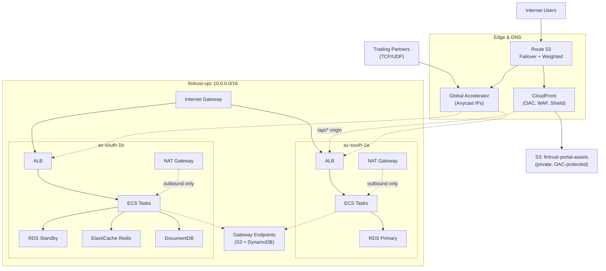

# Week 5 Day 4 — CloudFront Distribution, OAC, and Full Architecture Review

## Activity 176 Debrief — Route 53 Failover Timeline

| Step | What Happened | Elapsed Time |
|---|---|---|
| Health check polling | Route 53 probes the primary every 10s (Fast interval) | continuous |
| Failure detected | 3 consecutive failed probes | ~30s |
| Primary marked Unhealthy | Route 53 stops returning the primary record | at ~30s |
| Clients still see old answer | Cached DNS answer persists until TTL expires | up to 60s (TTL) |
| Secondary served | New DNS queries return the secondary record | after TTL expiry |
| Failback | Primary auto-resumes once health checks pass again | no manual step needed |

**Key lesson:** the health check *detects* the failure quickly, but the **TTL**
is what actually delays the user seeing the fix — these are two separate
clocks, not one. A 300-second TTL (instead of 60s) would have meant up to 5
minutes of users still hitting the dead primary, even though Route 53 already
knew about the failure within 30 seconds.

## CloudFront Distribution Configuration

- **Origin:** `fintrust-portal-assets-[name]` S3 bucket (private, all public access blocked)
- **Origin Access Control (OAC):** created during distribution setup, set to sign requests
- **Bucket policy:** restricts `s3:GetObject` to only the CloudFront distribution's ARN (copied directly from the CloudFront console banner, not written by hand)
- **Viewer protocol policy:** Redirect HTTP to HTTPS
- **Default root object:** `index.html`
- **Custom behavior:** `/api/*` → CachingDisabled (API responses are per-request and must never be served stale from cache)

## OAC vs OAI — In My Own Words

OAI (Origin Access Identity) is the older mechanism — it creates a special
IAM-like principal that the S3 bucket policy trusts, but it has a real gap:
it can't access S3 buckets encrypted with AWS KMS. OAC (Origin Access
Control) is the current recommended approach — it signs every request from
CloudFront to S3 using AWS's standard SigV4 signing process, which does
support KMS-encrypted buckets, and the bucket policy it generates is created
automatically from the CloudFront console rather than written by hand. Since
OAI is being phased out and OAC covers everything OAI does plus KMS support,
there's no real reason to reach for OAI on a new distribution — OAC is
simply the safer, more complete choice.

## Discussion Questions

**What if the S3 bucket policy was applied without CloudFront's OAC trusting it — would CloudFront still work?**
No. The bucket policy and the OAC have to reference each other correctly —
the policy needs to permit *that specific* CloudFront distribution's ARN, and
the distribution needs an OAC configured to sign its requests. If the policy
was written by hand without matching the OAC's identity, CloudFront's
signed requests to S3 would be rejected with Access Denied — the two sides
of this trust relationship have to line up exactly, which is exactly why
copying the auto-generated policy from the CloudFront console (rather than
writing it manually) matters.

**Where does WAF sit in the request path, and what does it prevent?**
WAF sits at the very edge, evaluating requests **before** they reach the
CloudFront cache or the origin at all. It can block SQL injection attempts,
XSS payloads, requests from specific IP ranges or countries, and can rate-limit
abusive request patterns — all rejected at the edge, meaning a malicious
request never even reaches S3 or the ALB origin, let alone consumes backend
resources.

**How does the setup change if I put a CDN in front of an ALB instead of just S3?**
The origin type changes from an S3 bucket to the ALB's DNS name, and OAC
becomes irrelevant — OAC is specifically an S3-access-control mechanism,
it has no equivalent concept for an ALB origin (the ALB is a real HTTP
server that accepts requests directly, not a private bucket needing a signed
handshake). The cache behavior for that path would typically be set to
CachingDisabled or a very short TTL too, since ALB origins are almost always
serving dynamic, per-request content rather than static files.

## Individual Reflection

**One scenario for CloudFront in front of an ALB, rather than serving S3 directly:**
FinTrust's `/api/*` traffic is a good example — even though the API itself
isn't cacheable, putting it behind CloudFront still gets it HTTPS termination
at more edge locations, AWS Shield's DDoS protection, and a WAF layer, all
before the request ever reaches the ALB. It's not about caching in this case
— it's about getting the same security and edge benefits CloudFront gives
static content, applied to dynamic traffic too.

**A developer pushes an urgent CSS fix behind a TTL=86400 cache. How do I get it to users immediately?**
Create a **CloudFront invalidation** for that specific path (e.g.
`/static/main.css`) rather than waiting a full day for the TTL to expire.
For future deploys, the better long-term fix is **filename versioning**
(`main.v2.css` instead of reusing `main.css`) — that avoids needing an
invalidation at all, since the browser and CloudFront both see it as a
genuinely new file with its own fresh cache entry.

## Full Week 5 Architecture

A high-resolution version of this same diagram is saved as
[`week5_network_diagram.png`](./week5_network_diagram.png).

## Architecture Gap Analysis — What's Not Yet Built

- No IAM policies, roles, or permission boundaries have been defined yet for who/what can touch these resources (Week 6)
- No monitoring — no CloudWatch alarms, dashboards, or logging (CloudTrail, VPC Flow Logs) are configured (Week 6)
- No WAF rules have actually been written yet, even though CloudFront supports attaching one (Week 6)
- No GuardDuty, Macie, or Security Hub — threat detection is entirely absent so far (Week 6)